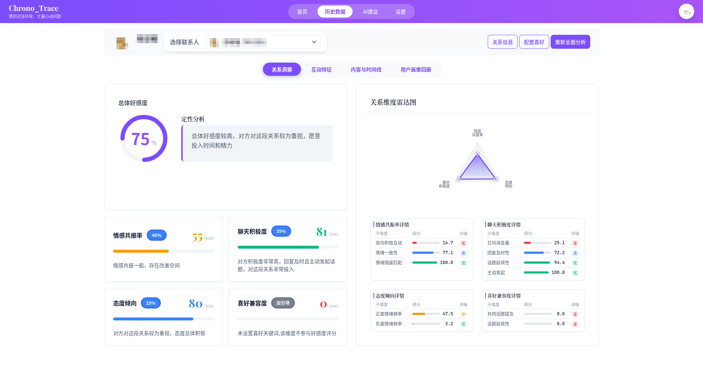
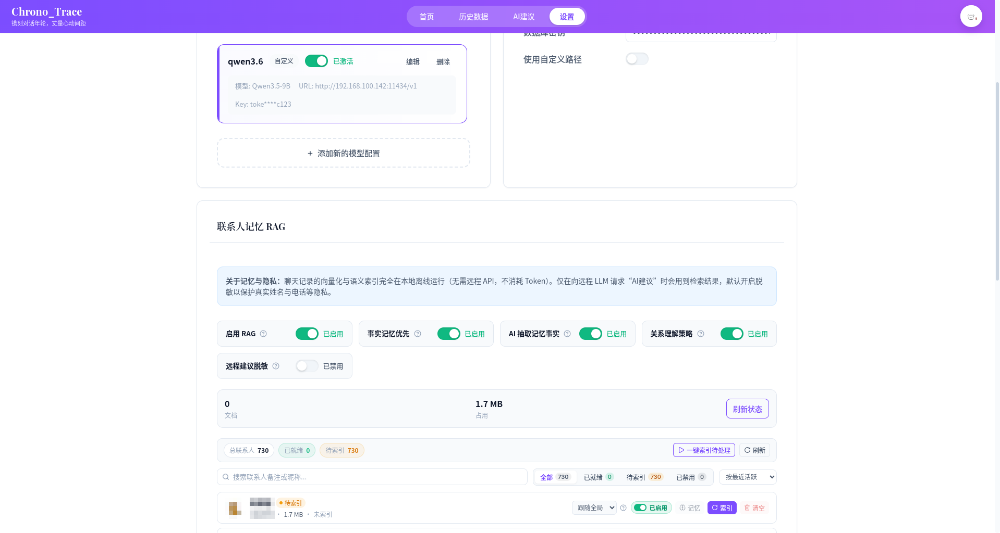

# Chrono Trace

<div align="center">
  
</div>

> 面向微信聊天记录的本地分析与实时辅助桌面工具。

[](https://www.python.org/)
[](https://vuejs.org/)
[](https://vitejs.dev/)
[](#环境要求)
[](./docs/release-notes-v1.1.0-beta.1.md)
[](./LICENSE)

> 镌刻对话年轮，丈量心动间距

---

## 许可与合规声明

本仓库当前以源码可见、非商业授权方式发布，适用 [PolyForm Noncommercial License 1.0.0](./LICENSE)。你可以在非商业场景下查看、学习、修改和分发本项目；任何商业使用、商业集成、商业分发或面向客户的部署，都需要获得项目维护者的单独书面授权。

Chrono Trace 不是腾讯或微信的官方项目，也未获得腾讯或微信的授权、认可或背书。本项目涉及的微信聊天数据导入、解析、监听与分析能力，仅应在你拥有合法访问权、处理权和必要授权的数据范围内使用。使用者需要自行确认其行为符合适用法律法规、平台规则、隐私保护要求和第三方协议。

本项目不鼓励、不授权也不支持任何侵犯他人隐私、绕过访问控制、规避第三方平台限制、未获授权抓取或商业化滥用聊天数据的行为。情绪、关系和沟通建议等分析结果仅供个人研究与辅助参考，不构成心理、医疗、法律或其他专业建议。

## 项目简介

Chrono Trace 是一个基于 `PyWebView + Vue 3 + Python` 的 Windows 桌面应用，围绕微信聊天数据提供三条主链路：

- 历史聊天导入与本地分析
- 实时监听与 AI 沟通建议
- 联系人长期记忆（RAG）：事实抽取、演变维护与纠错闭环

默认情况下，聊天数据解密、导入、存储和分析都在本机完成。只有在你启用 LLM 建议时，系统才会把生成建议所需的必要上下文发送到你配置的模型接口。

本地数据默认写入（安装版）：

```text
%LOCALAPPDATA%\Chrono Trace\chrono_trace.db
```

开发模式下数据写入仓库内 `backend\data\`。

## 界面预览

### 首页

**首页总览** —— 功能入口、账号切换、微信数据导入与运行日志


### 历史分析工作台（历史数据页）

**关系评估** —— 好感度总分、四维雷达图与分维度明细（情绪趋势、互动分析等页签同屏切换）



### AI 建议

**对象画像与建议策略** —— 联系人画像、聊天风格与关系策略、AI 建议生成配置


### 设置

**模型配置** —— 供应商/本地推理配置管理、微信数据库路径与密钥管理


**联系人记忆 RAG** —— 启用开关、索引状态统计、按联系人索引管理



## 核心能力

### 微信数据导入

- 内置密钥「登录捕获」：自动引导微信登录并在本机获取解密密钥，无需外部工具
- 保留手动输入密钥方式（可配合 `wx_key` 等工具获取）
- 自动扫描微信 `4.x` 数据目录，支持手动指定路径
- 多微信账号管理：账号切换、按账号隔离联系人与监听数据
- 联系人、会话、消息逐步入库，支持增量导入与导入统计

### 历史分析工作台

分析页当前聚焦这几类结果：

| 类别     | 内容                                   |
| -------- | -------------------------------------- |
| 情绪分析 | 情绪趋势、词云、情绪分布               |
| 互动分析 | 时间线、响应时间、主动率、字数投入比例 |
| 关系评估 | 好感度总分与分维度结果                 |
| 辅助信息 | 活跃日历、关系补充信息、偏好关键词配置 |

好感度分析目前采用四个维度：

| 维度       | 默认权重   | 说明                                       |
| ---------- | ---------- | ------------------------------------------ |
| 情感共振率 | 35% 或 40% | 情绪响应、极性一致性、强度匹配、共情信号   |
| 聊天积极度 | 35%        | 日均消息、回复及时性、话题延续性、主动发起 |
| 态度倾向   | 20% 或 25% | 正负向表达、称呼、隐私分享、节假日互动等   |
| 偏好兼容度 | 10%        | 用户配置喜好关键词后参与评分               |

说明：

- 配置了喜好关键词时，权重为 `35 / 35 / 20 / 10`
- 未配置喜好关键词时，偏好维度不参与，权重调整为 `40 / 35 / 25 / 0`

### 联系人长期记忆（RAG）

Beta 1.1 集中落地的记忆子系统，按联系人维护可追溯的长期记忆：

- **事实抽取**：从聊天记录中经 LLM 结构化抽取记忆事实，质量门拦截碎片化残句、一次性交易细节等噪音；支持断点续抽
- **事实演变链**：新事实修正/取代旧事实时保留完整审计记录（「以前不喜欢 → 现在改观了」），不再产生自相矛盾的重复记忆
- **偏好与雷点策略槽**：同一偏好的多次表达自动聚合为独立速查清单，生成建议时分开注入，顺着偏好、避开雷点
- **关系策略**：关系阶段、亲密度、相处边界（区分对方边界与我的边界）与沟通建议
- **纠错闭环**：在记忆管理界面标记「不准确/忘记」后，引用该记忆的策略即时刷新；「还原」同样生效
- **全链路可观测**：每次建议生成可追溯触发类型 → 召回 → 门控 → 注入 → 使用的策略版本

### 实时监听与 AI 建议

实时建议链路当前是：

1. 选择联系人并启动监听
2. 建立启动基线，避免把屏幕上已有旧消息当成新增消息
3. 对增量消息做去重、情绪判断和上下文整理
4. 按触发条件检索联系人记忆（召回 → 相关性门控 → 分槽注入）
5. 调用 LLM 生成建议（远程模型发送前默认脱敏，脱敏器不可用时阻断发送）
6. 在建议页和悬浮窗中查看结果

当前已落地的关键保护：

- 启动基线，降低旧消息误触发概率
- 监听阶段去重，结合内容、时间锚点和同屏次序识别重复消息
- LLM 上下文去重，减少重复上下文污染
- 会话隔离，避免旧线程把消息写进新会话
- checkpoint backfill，尽量补回连续上下文而不是断裂片段

### 悬浮辅助窗

适合边聊边参考的场景，支持：

- 联系人摘要与建议卡片
- 最近上下文与参考话术
- 模型切换

### 模型配置

通过设置页配置 OpenAI 兼容模型，当前已适配：

| 供应商 / 形态      | 说明                          |
| ------------------ | ----------------------------- |
| DeepSeek           | 在线 API                      |
| OpenAI             | 在线 API                      |
| 智谱 GLM           | 在线 API                      |
| Moonshot / Kimi    | 在线 API                      |
| MiniMax            | 在线 API                      |
| Ollama             | 本地推理                      |
| 自定义             | LM Studio 等任意 OpenAI 兼容接口 |

## 技术架构

```text
┌─────────────────────────────┐
│ Frontend                    │
│ Vue 3 + TypeScript + Vite   │
└──────────┬──────────────────┘
           │ PyWebView Bridge
┌──────────▼──────────────────┐
│ Backend                     │
│ Python Services             │
│ ├─ analysis/   历史分析      │
│ ├─ realtime/   实时监听+RAG  │
│ ├─ wechat/     数据导入      │
│ └─ gpu/        GPU runtime  │
└──────────┬──────────────────┘
           │
┌──────────▼──────────────────┐
│ Data Layer                  │
│ SQLite 本地存储              │
│ 微信数据库解密（SQLCipher）  │
└─────────────────────────────┘
```

项目目录概览：

```text
backend/
  app/
    db/              # SQLite schema、连接、迁移
    services/
      analysis/      # 历史分析、好感度分析
      realtime/      # 实时监听、情绪分析、AI 建议、联系人记忆（rag_*）
      wechat/        # 微信数据库扫描、解密、导入（含 V3/V4 适配层）
      gpu/           # CPU 安装包的 GPU runtime 下载
    webview/         # 前后端桥接
  scripts/           # 评测、回放、维护脚本
  tests/             # 后端测试

frontend/
  src/
    views/           # Home / Analytics / Suggestions / Settings / FloatingPanel
    components/      # 图表、好感度、人像、记忆管理等组件
    api/             # Bridge API 封装

docs/                # 方案、发布说明、评测产物
packaging/           # PyInstaller spec、Inno Setup、打包脚本
tools/               # 辅助验证工具

app.py               # 生产入口
app_dev.py           # 开发入口
requirements.txt
```

## 环境要求

| 项目    | 要求                                       |
| ------- | ------------------------------------------ |
| OS      | Windows 10 / 11；Linux（X11 桌面，Wayland 悬浮窗为固定档位） |
| Python  | Windows 3.12（依赖含 cp312 专用 wheel）；Linux 3.10+ |
| Node.js | 18+（Vite 5 要求）                         |
| 微信     | Windows PC 4.x / Linux 微信 4.x（原生版）   |

Windows 首次使用分析/实时建议时会从 ModelScope 自动下载本地情感模型，需要网络。

## 快速开始

### 1. 安装依赖

```bash
# Windows
pip install -r requirements.txt

# Linux（Debian/Ubuntu 示例）
sudo apt install gdb          # 密钥捕获需要
pip install -r requirements-linux.txt
pip install torch --index-url https://download.pytorch.org/whl/cpu

cd frontend
npm install
cd ..
```

### 2. 启动应用

开发模式：

```bash
python app_dev.py
```

生产模式：

```bash
cd frontend
npm run build
cd ..
python app.py
```

开发模式下，前端会由 Vite 提供在 `http://localhost:5173`。

### 3. 获取微信数据库密钥

Windows 推荐应用内置的**登录捕获**（重启微信引导流程）。

Linux 使用 **GDB 断点捕获**（免重启）：

1. 保持微信已登录，在应用中发起密钥获取
2. 应用自动分析微信二进制并附加断点
3. 在微信中「退出登录」→ 重新扫码/手机确认登录
4. 密钥自动捕获、验证并保存（一次性，后续直接使用）

手动方式（两平台通用）需自行获取密钥（如使用 [`wx_key`](https://github.com/ycccccccy/wx_key)），结果应为 `64` 位十六进制字符串：

```text
1a2b3c4d5e6f7890abcdef1234567890abcdef1234567890abcdef1234567890
```

### 4. 导入聊天数据

1. 启动应用并选择密钥获取方式（登录捕获或手动输入）
2. 让应用自动扫描微信目录
3. 若自动扫描失败，在界面里手动指定微信数据路径
4. 验证成功后开始导入
5. 在分析页查看结果

微信 `4.x` 常见目录形态：

```text
C:\Users\<用户名>\xwechat_files\wxid_xxx\db_storage\
├── contact\
├── message\
└── session\
```

### 5. 配置实时建议

1. 在设置页填写模型接口信息
2. 选择联系人并启动实时监听
3. 保持微信主窗口可见
4. 在建议页或悬浮窗查看输出

## 当前边界

- Windows 全功能；Linux 支持导入/分析/RAG 记忆/实时建议/悬浮窗（X11 跟随，Wayland 固定档位）
- Linux 实时监听走 `db_watch`（加密库文件直读 + WAL 增量），无需微信窗口可见；Windows 走 `native_uia`（依赖微信主窗口可见，最小化或后台不可见时不保证有效）
- Linux 密钥捕获需要 gdb 与 ptrace 权限（`ptrace_scope=0` 或 sudo）；微信更新后首次需重新登录一次以重新捕获
- 当前以单人聊天为主，不支持多会话并发监听
- 群聊不是当前主目标
- 文件、语音、视频、小程序卡片等复杂消息类型仍以规则识别和占位处理为主
- 建议质量的量化验收体系（人工回归集）建设中，当前以检索自洽性与人工事实抽查为准
- 偏好候选自动学习暂为影子模式（仅记录，不进入记忆）

## 开发

### 常用命令

```bash
# 启动桌面开发模式（推荐）
python app_dev.py
```

```bash
# 单独启动前端
cd frontend
npm run dev
cd ..
```

```bash
# 构建前端
cd frontend
npm run build
cd ..
```

```bash
# 运行后端测试
pytest backend/tests/
```

### 推荐先看的模块

- `backend/app/services/wechat/`：微信路径扫描、密钥捕获、解密、导入
- `backend/app/services/analysis/`：历史分析与好感度计算
- `backend/app/services/realtime/`：实时监听、触发、LLM 建议
- `backend/app/services/realtime/rag_*.py`：联系人长期记忆子系统（存储、抽取、召回、门控、注入）
- `backend/app/webview/bridge.py`：前后端桥接接口
- `frontend/src/views/`：主要页面入口
- `backend/scripts/`：评测、回放、维护脚本

更多文档见 [docs/](./docs/README.md)（含各版本发布说明索引）。

### 打包发布

项目当前已经接入 Windows 安装包打包链路。

一键打包：

```powershell
.\build_release.ps1
```

或直接双击：

```text
build_release.bat
```

核心打包脚本位于：

```text
packaging\build_release.ps1
```

仓库会自动复用或初始化 `.venv-packaging` 作为打包专用环境，减少系统 Python 杂项依赖对 PyInstaller 的影响。

可选打包变体：

```powershell
.\build_release.ps1 -Variant cpu
.\build_release.ps1 -Variant gpu
.\build_release.ps1 -Variant both
```

生产环境测试回归推荐使用快速模式：

```powershell
.\build_release.ps1 -Fast
```

如果快速模式也要生成安装包：

```powershell
.\build_release.ps1 -Fast -IncludeInstaller
.\build_release.ps1 -Fast -Variant both -IncludeInstaller
```

打包产物位置：

```text
release\pyinstaller\Chrono Trace\
release\pyinstaller-gpu\Chrono Trace\
release\installer\
```

其中安装包用于正式分发：

```text
release\installer\ChronoTraceSetup-版本号.exe
release\installer\ChronoTraceSetup-版本号-GPU.exe
```

说明：

- `CPU` 安装包默认内置 CPU 版 PyTorch
- `GPU` 安装包在构建时直接带入 CUDA 版 PyTorch
- `CPU` 包内如果检测到 NVIDIA GPU，可额外下载独立 GPU runtime 到 `%LOCALAPPDATA%\Chrono Trace\runtime\gpu`，重启应用后生效

### 调试建议

- 导入问题优先看路径扫描、密钥校验和数据库解密日志
- 实时监听问题优先确认微信窗口可见，再看 `realtime` 相关日志
- 如果导入成功但结果异常，先直接检查本地用户数据目录中的 SQLite 数据库

## 常见问题

### 未找到微信数据目录

- 确认微信已安装并登录
- 确认版本是 `4.x`
- 改为手动指定路径

### 密钥验证失败

- 优先重试应用内的登录捕获
- 确认密钥是 `64` 位十六进制字符串
- 手动方式可重新运行 `wx_key` 获取

### 导入成功但数据为 0

- 检查是否选错了微信数据目录
- 检查解密后的数据库是否可正常读取
- 检查导入日志和本地 SQLite 数据

### 实时监听没有反应

- 确认当前是单人聊天窗口
- 确认微信主窗口没有最小化
- 确认模型配置可用

## 隐私与安全

- 聊天数据默认只保存在本地
- 事实记忆为本地处理；使用远程大模型时内容默认脱敏，脱敏器不可用时阻断发送（绝不降级发原文）
- 解密过程中产生的临时文件应由程序自行清理
- 启用在线模型前，请自行评估上下文发送范围和隐私边界

## 致谢

- [EchoTrace](https://github.com/ycccccccy/echotrace)：微信数据解密参考
- [wx_key](https://github.com/ycccccccy/wx_key)：微信数据库密钥获取工具

## 免责声明

本项目仅供个人学习、研究和本地数据分析使用，不是腾讯或微信的官方项目，也未获得腾讯或微信的授权、认可或背书。

请仅在你拥有合法访问权、处理权和必要授权的数据范围内使用本工具，并自行确认相关行为符合适用法律法规、平台规范、隐私保护要求和第三方协议。项目不鼓励、不授权也不支持侵犯他人隐私、绕过访问控制、规避第三方平台限制、未获授权抓取或商业化滥用聊天数据的行为。

情绪、关系和沟通建议等分析结果仅供辅助参考，不构成心理、医疗、法律或其他专业建议。项目维护者不对因使用本工具产生的任何后果承担责任。

---

最后更新：2026-09-26
